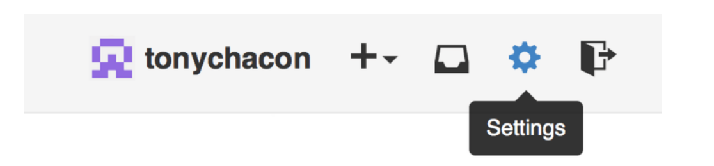

---
### Настройка аккаунта

Первым делом нужно создать бесплатную учётную запись. Просто зайдите на
[GitHub](https://github.com), выберите имя которое ещё не занято, укажите адрес электронной почты и
пароль, а затем нажмите большую зелёную кнопку *«Sign up for GitHub»* .

#### Доступ по SSH
На данный момент вы можете подключаться к репозиториям Git используя протокол
*https://* авторизуясь при помощи только что созданного логина и пароля. Однако для того
чтобы просто клонировать публично доступный проект, вам необязательно
авторизовываться на сайте, но тем не менее, только что созданный аккаунт понадобится в
то время, когда вы захотите загрузить (push) сделанные вами изменения.

Если же вы хотите использовать SSH доступ, в таком случае вам понадобится добавить
публичный SSH ключ. (Если же у вас нет публичного SSH ключа, вы можете его
сгенерировать)

Откройте настройки вашей учётной записи при помощи ссылки,
расположенной в верхнем правом углу окна:

Выберите секцию слева под названием «Ключи SSH» («SSH keys»).

Затем нажмите на кнопку *«Добавить ключ SSH» («Add an SSH key»)*, задайте имя ключа, а так
же скопируйте и вставьте сам публичный ключ из ~/.ssh/id_rsa.pub (ну или как бы у вас не
назывался этот файл) в текстовое поле, затем нажмите *«Добавить ключ» («Add key»)*.

---
