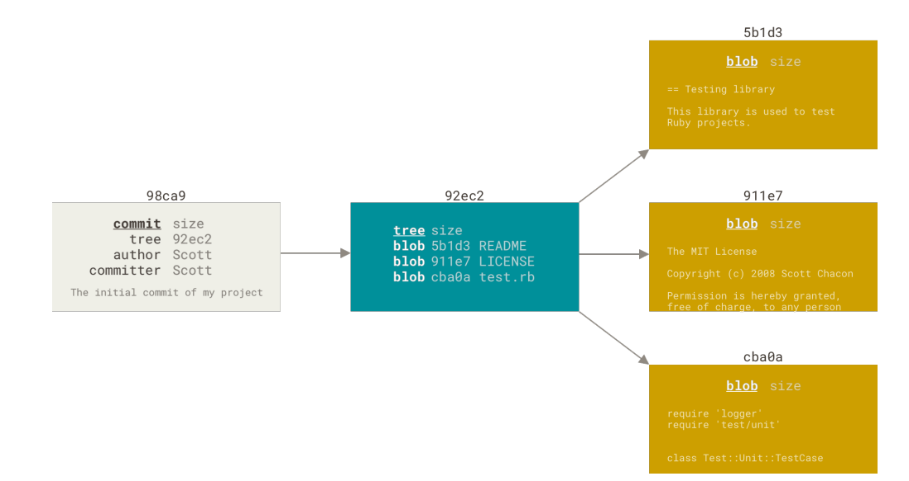

---
### Ветвление
Git не хранит данные в виде последовательности
изменений, он использует набор снимков (snapshot).

Когда вы делаете коммит, Git сохраняет его в виде объекта, который содержит указатель на
снимок (snapshot) подготовленных данных.  
Этот объект так же содержит *имя автора* и
*email*, сообщение и указатель на коммит или коммиты непосредственно предшествующие
данному (его родителей): отсутствие родителя для первоначального коммита, один
родитель для обычного коммита, и несколько родителей для результатов слияния двух и
более веток. 

Предположим, у вас есть каталог с тремя файлами и вы добавляете их все в индекс и
создаёте коммит. Во время индексации вычисляется контрольная сумма каждого файла, затем каждый файл сохраняется в репозиторий (Git
называет такой файл *блоб* — большой бинарный объект), а контрольная сумма попадёт в
индекс:
> `git add README test.rb LICENSE`  
`git commit -m 'Initial commit'`

Когда вы создаёте коммит командой `git commit`, Git вычисляет контрольные суммы каждого
подкаталога (в нашем случае, только основной каталог проекта) и сохраняет его в
репозитории как объект дерева каталогов.  
Затем Git создаёт объект коммита с
метаданными и указателем на основное дерево проекта для возможности воссоздать этот
снимок в случае необходимости.

Ваш репозиторий Git теперь хранит пять объектов: три блоб объекта (по одному на каждый
файл), объект дерева каталогов, содержащий список файлов и соответствующих им блобов,
а так же объект коммита, содержащий метаданные и указатель на объект дерева
каталогов.

